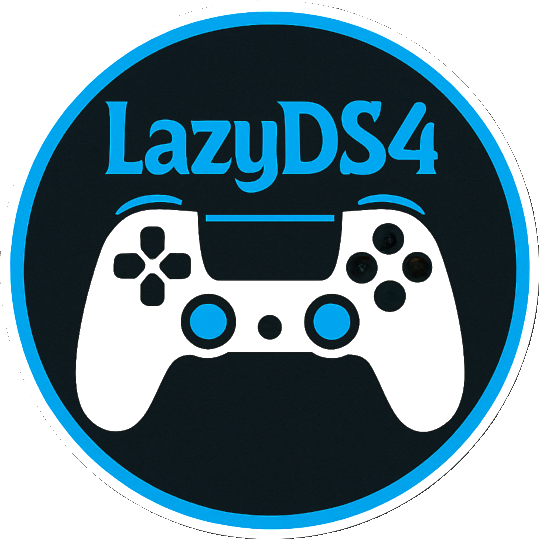
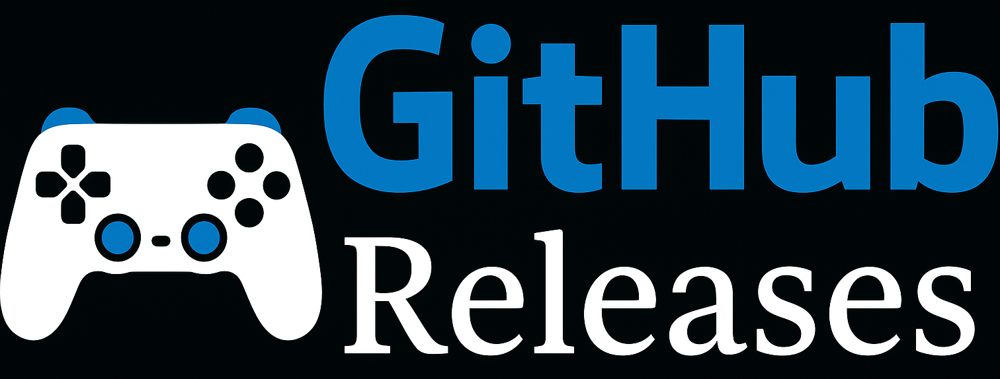
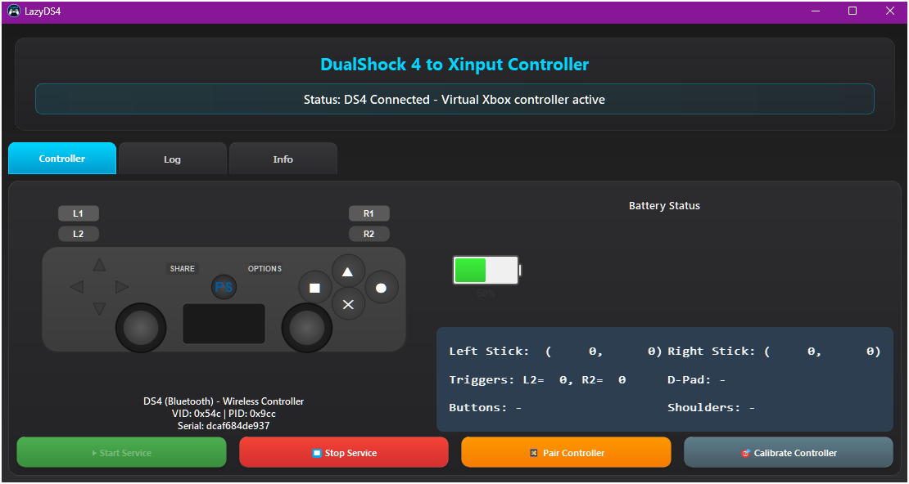
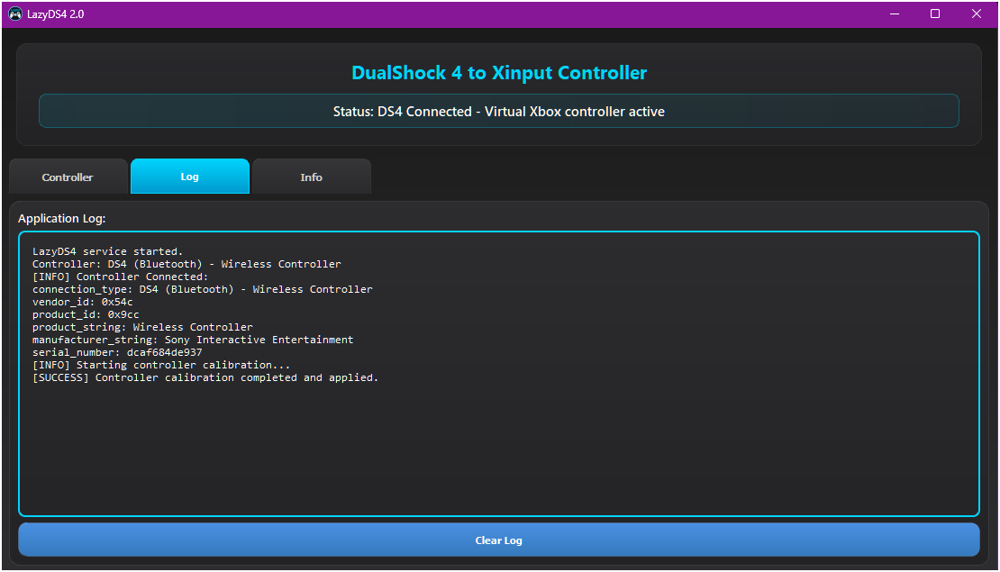
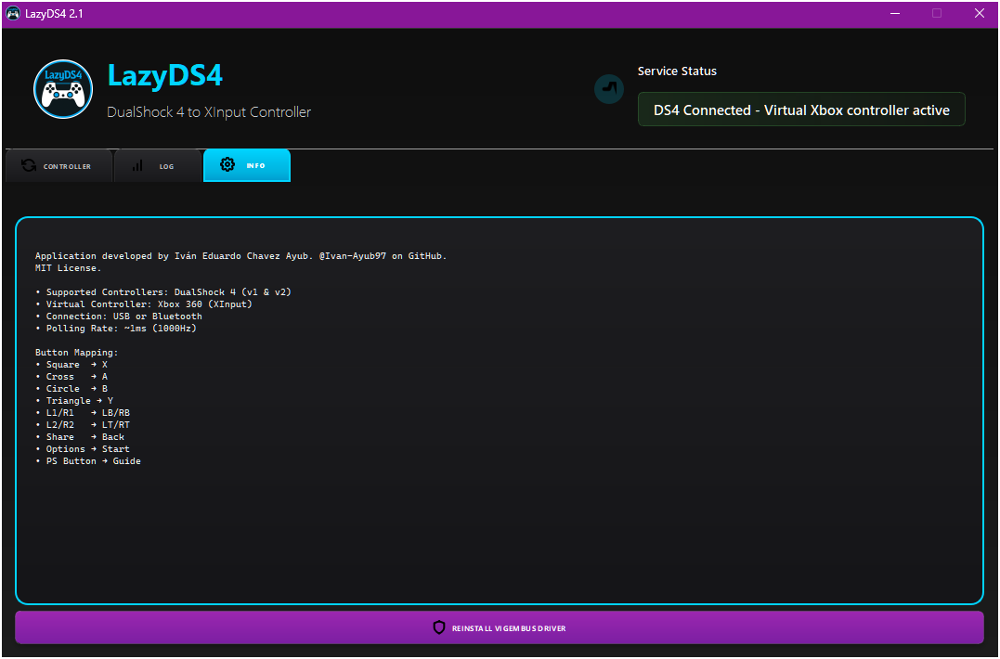
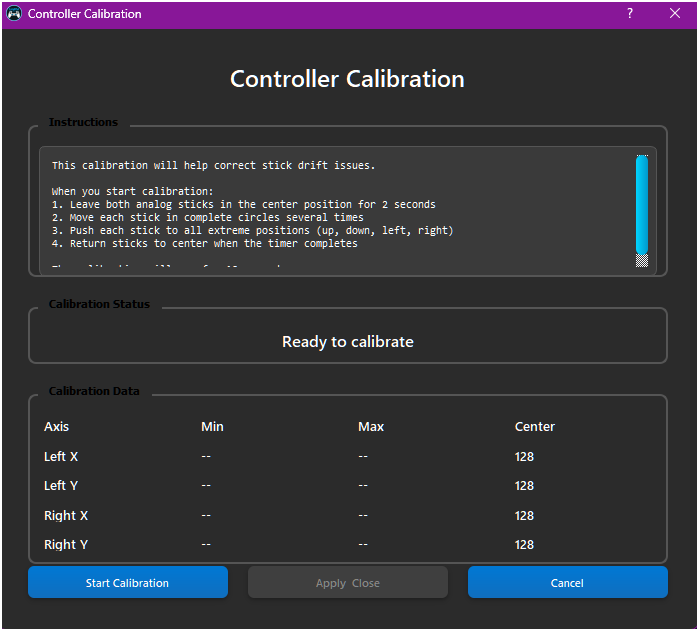

<div align="center">

# LazyDS4

### _Direct DualShock 4 to XInput Mapper for Windows_

[](#)
[](#)
[](LICENSE)
[](#)

_"Transform your DualShock 4 into a native Xbox 360 controller"_

</div>

---

## 🧩 Description

**LazyDS4** is a controller mapping application designed to convert HID input from a DualShock 4 controller directly to a virtual Xbox 360 controller. Inspired by DS4Windows but optimized for simplicity and performance, it offers real-time input mapping with a ~1ms (1000Hz) polling rate, modern graphical interface with PyQt5, and automatic joystick calibration.

---

## 🚀 Download and Installation

Get the latest stable release from any of the following platforms:

<table>
  <tr>
    <td align="center" width="33%">
      <a href="https://sourceforge.net/p/LazyDS4/">
        
      </a>
    </td>
    <td align="center" width="33%">
      <a href="https://github.com/Ivan-Ayub97/LazyDS4/releases/download/1.0.0/LazyDS41.0.0Setup.zip">
        
      </a>
    </td>
  </tr>
</table>

### Quick Installation

1. Download the installer `LazyDS4-1.0.0-Installer.exe`
2. Run as administrator (required for ViGEmBus)
3. Installer will automatically setup ViGEmBus driver
4. Launch LazyDS4 from start menu or shortcut

---

## 🖼️ Interface Preview

### 💻 Main View



- **Controller Tab**: Interactive DS4 visualization with real-time status
- **Battery Monitor**: Visual indicator with level, charging state, and alerts
- **Controls**: Start/Stop buttons, Bluetooth Pairing, Calibrate

### 🧪 Other Views



- **Log Tab**: Detailed event and error logging



- **Info Tab**: Developer information, button mapping, and utilities



- **Calibration Dialog**: Interactive tool to adjust joysticks

---

## ✨ Key Features

- ✅ **Direct HID to XInput Mapping** — Optimized real-time translation
- ✅ **USB and Bluetooth Connection** — Complete support for DS4 v1 and v2
- ✅ **1000Hz Polling Rate** — Ultra-fast response of ~1ms
- 🎨 **Modern Interface** with dark theme design and visual effects
- 🔋 **Battery Monitor** with low battery alerts and charging status
- 🎯 **Joystick Calibration** with customizable deadzone settings
- 🔧 **Automatic ViGEmBus Installation** and driver management
- 📱 **Integrated Bluetooth Pairing Assistant**
- 🎮 **Interactive Controller Visualization** in real-time

---

## 📌 What's New (v1.0.0)

- 🆕 Full implementation of DS4 to XInput mapping
- 🔋 Battery monitoring system with visual alerts
- 🎯 Integrated joystick calibration tool
- 📱 Bluetooth pairing assistant with PowerShell
- 🎨 Modern graphical interface with dark theme and effects
- 🔧 Automatic ViGEmBus driver installation
- ⚡ Performance optimization with 1000Hz polling

---

## ⚙️ How to Use

1. **Connect your DualShock 4** via USB or Bluetooth
2. **Open LazyDS4** as administrator (recommended)
3. **Press "▶ Start Service"** to start mapping
4. **Configure as needed**:
   - Calibrate joysticks if drift occurs
   - Pair new Bluetooth controllers
   - Monitor battery and connection status
5. **Enjoy Playing!** Your DS4 now works as an Xbox 360 controller

---

## 📊 Button Mapping

| **DualShock 4** | **Xbox 360** | **Function**  |
| --------------- | ------------ | ------------- |
| ✕ (Cross)       | A            | Confirm       |
| ● (Circle)      | B            | Cancel        |
| ■ (Square)      | X            | Action        |
| ▲ (Triangle)    | Y            | Action        |
| L1              | LB           | Left Bumper   |
| R1              | RB           | Right Bumper  |
| L2              | LT           | Left Trigger  |
| R2              | RT           | Right Trigger |
| Share           | Back         | Menu          |
| Options         | Start        | Pause         |
| PS Button       | Guide        | Xbox Home     |

---

## 💾 Project Structure

```
LazyDS4/
├── assets/                    # Resources (icons, ViGEmBus installer)
├── core/                      # Main controller logic
│   ├── ds4_controller.py      # DualShock 4 handling
│   └── vigem_controller.py    # ViGEm virtual controller
├── ui/                        # PyQt5 graphical interface
│   ├── main_window.py         # Main window
│   ├── battery_widget.py      # Battery widget
│   ├── interactive_controller.py # Controller visualization
│   └── calibration_dialog.py  # Calibration dialog
├── utils/                     # System utilities
│   ├── input_translator.py    # HID to XInput translator
│   ├── vigem_setup.py         # ViGEmBus installer
│   └── bluetooth_manager.py   # Bluetooth manager
├── LazyDS4.py                 # Main file
├── build.py                   # Build script
├── Setup.iss                  # Inno Setup script
└── requirements.txt           # Python dependencies
```

---

## 📋 System Requirements

- **OS:** Windows 10/11 (x64/x86/ARM64)
- **RAM:** Minimum 2GB (4GB recommended)
- **Controller:** DualShock 4 v1 or v2 (CUH-ZCT1/ZCT2)
- **Connection:** USB or Bluetooth 4.0+
- **Privileges:** Administrator (for ViGEmBus)
- **Dependencies:** ViGEmBus driver (installed automatically)

---

## 📦 Technologies Used

| Technology   | License      | Author/Maintenance           | Link                                                     |
| ------------ | ------------ | ---------------------------- | -------------------------------------------------------- |
| Python 3.10+ | PSF License  | Python Software Foundation   | [python.org](https://python.org)                         |
| PyQt5        | GPL v3       | Riverbank Computing          | [riverbankcomputing.com](https://riverbankcomputing.com) |
| hidapi       | BSD-3-Clause | Alan Ott, Signal 11 Software | [GitHub](https://github.com/libusb/hidapi)               |
| vgamepad     | MIT License  | Yann Bouteiller              | [GitHub](https://github.com/yannbouteiller/vgamepad)     |
| ViGEmBus     | MIT License  | ViGEm Project                | [GitHub](https://github.com/ViGEm/ViGEmBus)              |
| PyInstaller  | GPL-2.0+     | PyInstaller Development Team | [pyinstaller.org](https://pyinstaller.org)               |
| Inno Setup   | Inno License | Jordan Russell               | [jrsoftware.org](https://jrsoftware.org)                 |

---

## 🧑‍💻 Contributing

Contributions are welcome!

1. Fork the project
2. Create a branch for your improvement (`git checkout -b feature/new-feature`)
3. Make your changes and commit them (`git commit -am 'Add new feature'`)
4. Push to the branch (`git push origin feature/new-feature`)
5. Open a Pull Request with details

For bug reports or suggestions: **GitHub Issues** or contact the developer

---

## 📜 License

© 2025 Iván Eduardo Chavez Ayub (@Ivan-Ayub97)
Distributed under the MIT License. See `LICENSE` for more details.

---

## 🔧 Development and Compilation

### For Developers

```bash
# Clone repository
git clone https://github.com/Ivan-Ayub97/LazyDS4.git
cd LazyDS4

# Install dependencies
pip install -r requirements.txt

# Run in development mode
python LazyDS4.py

# Build executable
python build.py
```

### Included Scripts

- **`build.py`**: Automated build with PyInstaller
- **`Setup.iss`**: Installer creation with Inno Setup
- **`LazyDS4.spec`**: Advanced PyInstaller configuration

---

**Built by the lazy, for the lazy.**
